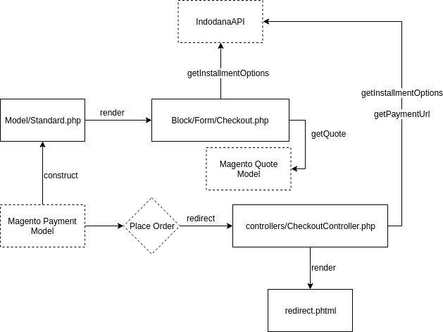

# Magento 1

## Getting Started

### Application Setup

1. Setup Database

    ```
    mysql> CREATE DATABASE magento1;

    mysql> CREATE USER 'magento1' IDENTIFIED BY 'magento1';

    mysql> GRANT ALL PRIVILEGES ON magento1.* TO 'magento1';
    ```

    > If you found this error:<br><br>
    `ERROR 1819 (HY000): Your password does not satisfy the current policy requirements`<br><br>
    See the solution [here](https://sysfiddler.com/mysql-error-1819-hy000-your-password-does-not-satisfy-the-current-policy-requirements/)

2. Run your Magento application

    ```
    $ make magento1-install-dependencies

    $ make magento1-serve
    ```

    > Make sure `composer` is already installed on your computer

3. Go to `http://localhost:6031`

    > When doing this on the first time, it will automatically migrates SQL schema to `magento1` database that you just made

4. Create Magento admin account. See the instructions [here](https://stuntcoders.com/snippets/create-magento-admin-user-through-database/)

    > This step is required for login on `http://localhost:6031/admin`

5. Make sure to disable cache during development on `System > Cache Management > Select All > Actions: Disable > Submit`

6. Setup Indodana Payment configuration on `System > Configuration > Payment Methods > Indodana Payment`

### Admin Setup

This is the minimal setup so that customer can purchase item on your e-commerce website:
1. Change the currency to IDR. See the instructions [here](https://docs.magento.com/m1/ce/user_guide/configuration/currency-setup.html)
2. Add products to be sold. See the instructions [here](https://www.siteground.com/tutorials/magento-1/products/)


## Concepts

Magento realies heavily on Convention over Configuration.

### Plugin Structure

Magento determines available plugins by iterating through xmls in `app/etc/modules`.

Here is `Indodana_Payment.xml`:
```
<?xml version="1.0"?>
<config>
    <modules>
        <Indodana_Payment>
            <active>true</active>
            <codePool>community</codePool>
            <depends>
                <Mage_Payment />
            </depends>
        </Indodana_Payment>
    </modules>
</config>
```

Reading the configuration above, we can guess that this files define a plugin called `Indodana_Payment` that depends on `Mage_Payment` and is currenctly active.

Now if we navigate to `app/code`. Notice that the folder `community` match the value specified in `codePool`. Basically, `codePool` define in which folder does a module reside, although the options itself is limited to:
* community (for 3rd party modules)
* local (for local private modules)
* core (core magento modules)

Inside `community` folder we can find our plugin residing in the folder `Indodana`. This is the namespace for our modules. Digging deeper down we'll find the folder `Payment`, this is our module name. Now if you notice, the name of our module configuration file is `Indodana_Payment.xml` while inside it we define the modules as `<Indodana_Payment>`. It is not coincidence that this value match the directory of our modules `Indodana/Payment`. This is one of convention that magento use and it will need a bit of time to get used to this.

Inside `Payment` folder, there are five more folders:
* Block
* controllers
* etc
* Helper
* Model

We'll asume that you know about `controllers`, `Helper`, and `Model` already. But the most important part for now is `etc`. Here we'll find more configuration for our plugins. There will be two xmls, `config.xml` and `system.xml`.

`config.xml` defines additional configuration for our modules, like Helper or Block file location, etc. Most of this should be self-explanatory but let's focus on this part:
```
<routers>
    <indodanapayment>
        <use>standard</use>
        <args>
            <module>Indodana_Payment</module>
            <frontName>indodanapayment</frontName>
        </args>
    </indodanapayment>
</routers>
```
`frontName` define the endpoint of our modules. For example, if we put this modules in an ecommerce website that resides in `magento.indodana.com` and our `frontName` value is `indodanapayment` then our controllers can be accessed from url `magento.indodana.com/indodanapayment`.

### File Naming

File naming in Magento is very strict, miss one letter and hell will break lose. But fear not there's just one rule that we need to remember. **Always put your namespace and module name first**, and **use the combination of Pascal Case and Snake Case for the class name**. Okay that's two rules but we hope you got the point. Here is an example from our `CheckoutController.php`

`Indodana_Payment_CheckoutController`

Tada!!! Simple, right? Just follow this pattern:

```
{NAMESPACE}_{MODULE_NAME}_{PATH_TO_FILE_WITH_UNDERSCORE}
```

And make sure `PATH_TO_FILE_WITH_UNDERSCORE` ends with `Controller` for your module's controller.

What about the rest of the modules? It still follows the above rules. Here are some examples:
- `Helper/Data.php` -> `Indodana_Payment_Helper_Data`
- `Model/Standard.php` -> `Indodana_Payment_Model_Standard`

One last thing, the name of the model `Standard.php` is also a convention, so changing it will break the code. In the scope of our current project we will not need to add another model so it is fine.

### Controller's Workflow

Let's recall `frontName` from the previous section. Every request that comes to `baseUrl/frontName` will be handled by appropriate controllers for modules assosiated with the `frontName`. Okay that part might be confusing but here is an example.

Let's say our current module have `indodanapayment` as frontName. We also have a controllers called `CheckoutController.php`. Now this controller will catch all request that comes to `indodanapayment/checkout`. 

Now the question is, which function will handle the request? If the request comes through `indodanapayment/checkout` then it will be directed to `indexAction` function in `CheckoutController`. Why index? because `indodanapayment/checkout` is the same as `indodanapayment/checkout/index`. The Action keyword appended on the back is just one of many Magento's convention. 

So what happens if a request comes to `indodanapayment/checkout/redirect`? Then the function that will handle it will be named `redirectAction` in `CheckoutController.php`.

### Plugin's Workflow

