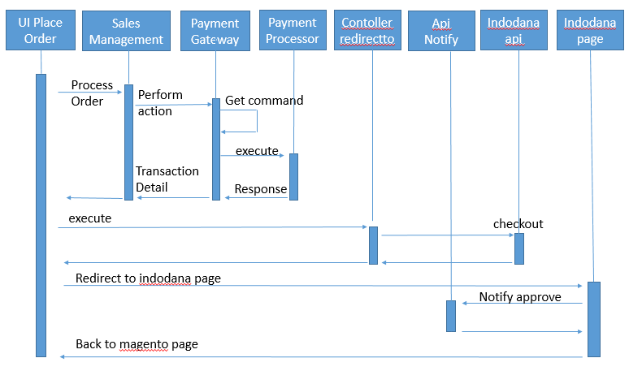

# Indodana PayLater payment method module for Magento 2.4.4 - 2.4.8

## Compatibility

| | |
|---|---|
| **Magento** | 2.4.4 - 2.4.8 |
| **PHP** | 8.1 / 8.2 / 8.3 |

> **PHP 7 is not supported.** Magento 2.4.4 dropped PHP 7, so this module requires
> PHP 8.1 or newer. There is no PHP version that runs both 2.4.3 and 2.4.4, which is
> why the plugin ships as two separate modules.

**Running Magento 2.4.0 - 2.4.3 on PHP 7.3 / 7.4?** Use [`magentov2.4.0`](../magentov2.4.0)
instead — download the `magento_v2.4.0-*.zip` asset from a `MagentoV2.4.0-*` release.

Verified against the following combinations (see `testing/magento/docker-compose.yml`):

| Magento | PHP | Search engine |
|---------|-----|---------------|
| 2.4.4   | 8.1 | Elasticsearch 7.17 |
| 2.4.5   | 8.1 | Elasticsearch 7.17 |
| 2.4.6   | 8.2 | OpenSearch 2.5 |
| 2.4.7   | 8.3 | OpenSearch 2.12 |
| 2.4.8   | 8.3 | OpenSearch 2.19 |

# Application Instalation
    1. Setup Database, create user and database for magento 
        ```sql
        mysql> CREATE DATABASE magento;
        mysql> CREATE USER 'magento' IDENTIFIED BY 'magento';
        mysql> GRANT ALL PRIVILEGES ON magento.* TO 'magento';
        ```
    2. Download magento from https://magento.com/tech-resources/download and extract 
    3. Set permission 
    3. Install magento, step by step installation can follow https://devdocs.magento.com/guides/v2.4/install-gde/install-quick-ref.html


# Magento Structure
    Magento Root -
                 |-app
                 |  |-code
                 |      |-Module Indodana
                 |-var
                    |-log
                        |-Indodana
# Plugin Installation 
    1. Download release version Plugin MagentoV2
        https://github.com/indodana/paylater-ecommerce-plugin-php/releases
    2. Extract 
    3. Copy plugin/app/ to <magento root>/app/
    4. Set folder Acces Permission 
        cd <magento_root>
        find var generated vendor pub/static pub/media app/etc -type f -exec chmod u+w {} +
        find var generated vendor pub/static pub/media app/etc -type d -exec chmod u+w {} +
        chmod u+x bin/magento
    5. Run <magento_root>$sudo bin/magento setup:upgrade
    6. Run <magento_root>$sudo bin/magento module:enable Indodana_PayLater
    7. Run <magento_root>$sudo bin/magento setup:upgrade
    8. if magento mode is developer you can skip below command ( we suggest to skip this)
            Run <magento_root>$sudo bin/magento setup:di:compile
    9. Run <magento_root>$sudo bin/magento setup:static-content:deploy –f
    10. make sure apache/ngix has write access
        or you can run below command  
        sudo chown -R ubuntu:www-data <magento_root>
    11. Set Currency = IDR
   

# Plugin Structure
    |-code
        |-Indodana
            |-Paylater
                |-Api
                |-Block
                |-Controller
                |-etc
                |-Gateway
                |-Helper
                |-i18n
                |-Model
                |-Observer
                |-view
for detail guidelines can see [magento-module-file-structure](https://devdocs.magento.com/guides/v2.4/extension-dev-guide/build/module-file-structure.html)


# Plugin workflow 



    |-Controller\Index
        |-paymentoptions.php    => to handle get installment options
        |-redirectto.php        => to handle checkout process to indodana payment
        |-cancel.php            => to handle cancel process of cart

    |-Api
        |-NotifyInterface.php   => Api Interface to handle notification result from indodana
    |-Model
        |-Api
            |-Notify.php        => Implemtation of Notify Interface to handle notification result from indodana
    |-view\frontend\web\template\payment
        |-form.html             => html view of installment options


more Information check [payment-gateway-intro](https://devdocs.magento.com/guides/v2.3/payments-integrations/payment-gateway/payment-gateway-intro.html) 
and [payment-gateway-structure](https://devdocs.magento.com/guides/v2.4/payments-integrations/payment-gateway/payment-gateway-structure.html)

