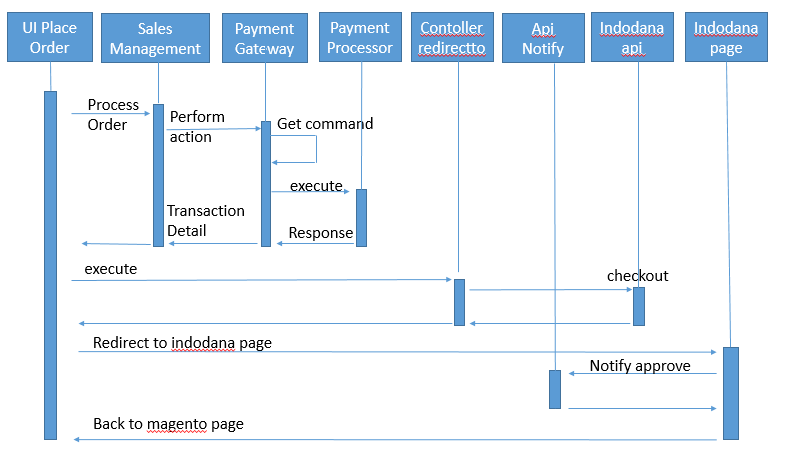

# indodana paylater payment method module for magento >= 2.3.x 
# Application Instalation
    1. Setup Database, create user and database for magento 
    2. Download magento from https://magento.com/tech-resources/download
    3. Install magento as instructed
# Magento Structure
    Magento Root -
                 |-app
                 |  |-code
                 |      |-Module Indodana
                 |-var
                    |-log
                        |-Indodana

# Plugin Structure
    |-code
        |-Indodana
            |-Paylater
                |-Api
                |-Block
                |-Controller
                |-etc
                |-Gateway
                |-Helper
                |-i18n
                |-Model
                |-Observer
                |-view
for detail guidelines can see [magento-module-file-structure](https://devdocs.magento.com/guides/v2.4/extension-dev-guide/build/module-file-structure.html)

# Plugin workflow 

more Information check [payment-gateway-intro](https://devdocs.magento.com/guides/v2.3/payments-integrations/payment-gateway/payment-gateway-intro.html) 
and [payment-gateway-structure](https://devdocs.magento.com/guides/v2.4/payments-integrations/payment-gateway/payment-gateway-structure.html)

                